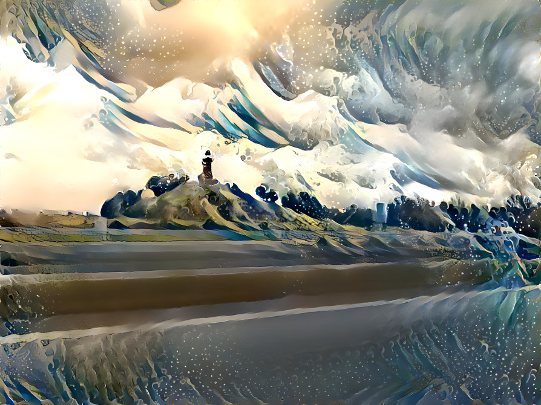

# Profile

## Content
1. [Licenses](licenses/readme.md)
2. [Documentation](docs/readme.md)

## About me
28 Years old and currently studying BSc. in Web Development 
at [Business Academy of Southwest](https://www.easv.dk/en/), in Denmark, Esbjerg.
Beside studying a BSc. i have a Multimediadesigner AK education too, 
which I completed at [Business Academy of Southwest](https://www.easv.dk/en/).

## Projects

## Code
Topics i am interested in:
| Topics               |                    |
| -------------------- | ------------------ |
|                      |                    |

### Development
Programming languages that are used in application developments.
| Programming Languages | Interested in      |
| --------------------- | ------------------ |
| JavaScript            | Rust               |
| Scala                 | Haskell            |
| Java                  |                    |
| C#                    | Go                 |
| C++                   | TypeScript         |
|                       | Kotlin             |

The different tools used for web development usually.
| Tools used            |
| --------------------- |
| JavaScript            |
| HTML                  |
| CSS                   |
| Sass                  |
| PHP                   |

Languages often used for scripting:
| Script languages      |
| --------------------- |
| Python                |
| Bash Shell            |
| JavaScript            |

## Social
| Social Media                                                             | Package Managers                                                   |
| ------------------------------------------------------------------------ | ------------------------------------------------------------------ |
| [DeviantArt](https://www.deviantart.com/designermadsen)                  | [Crates, Profile](https://crates.io/users/kentvejrupmadsen)        |
| [DeepDream](https://deepdreamgenerator.com/u/designermadsen)             | [Docker, Profile](https://hub.docker.com/u/designermadsen)         |
| [Facebook](https://www.facebook.com/kentvejrupmadsen/)                   | [Packagist, Profile](https://packagist.org/users/designermadsen/)  |
| [Youtube](https://www.youtube.com/channel/UCKKk3v5CdelOvhFcmvJ9Biw)      | [NPM, Profile](https://www.npmjs.com/~kentvejrupmadsen)            |
| [LinkedIn](https://www.linkedin.com/in/kent-vejrup-madsen/)              | [NuGet, Profile](https://www.nuget.org/profiles/GoalPioneers)      |
| [Tumblr](https://kent-vejrup-madsen.tumblr.com/)                         | [Kaggle, Profile](https://www.kaggle.com/kentvejrupmadsen)         |
| [Twitter](https://twitter.com/Designermadsen)                            |                                                                    |

### Other
[Folder@Home](https://stats.foldingathome.org/donor/name/designermadsen) and is member 
of the group [GoalPioneers](https://stats.foldingathome.org/team/258462) on folding@home.

## Footnotes
* Created at: 20 Juni 2022
* Last updated at: 27 July 2022
* Copyright 2022 Kent vejrup Madsen
